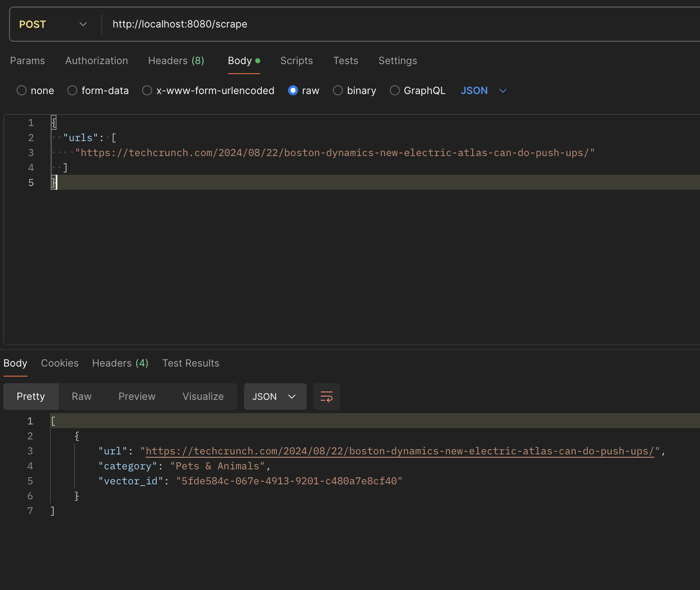
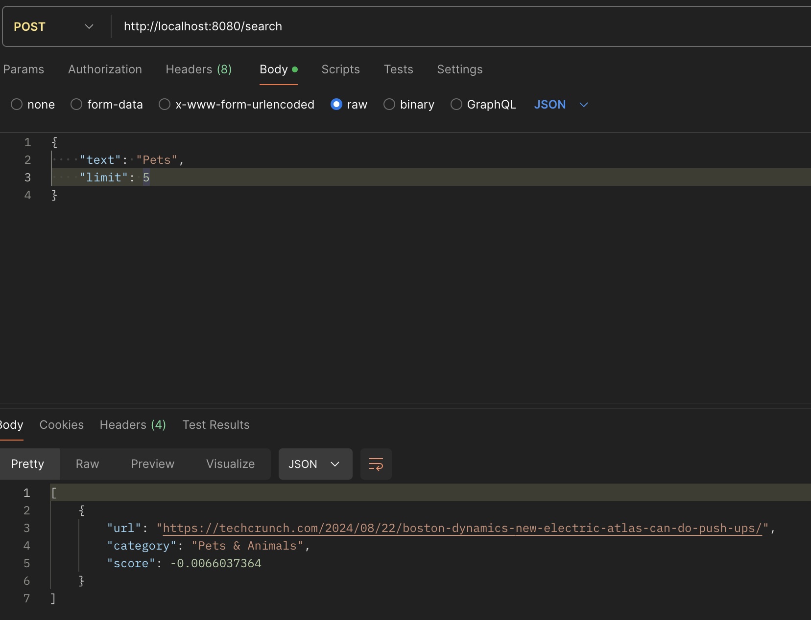
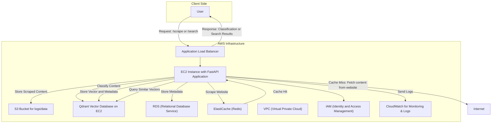

# Web Classification and Search API

This project is a FastAPI-based system that combines web scraping, multi-class content classification, and semantic search. It utilizes the Qdrant vector database for efficient storage and retrieval of vectorized website content, and leverages machine learning models from Hugging Face for content classification.

The system provides two main API endpoints:
1. **Scrape, Classify & Store**: Scrapes websites, classifies their content, and stores the results in the vector database.
2. **Semantic Search**: Searches for websites with content similar to a given text.

## Repository Structure

```
webclassify/
│
├── app/
│   ├── __init__.py
│   ├── cache.py
│   ├── classifier.py
│   ├── main.py
│   ├── scraper.py
│   └── vector_db.py
│
├── tests/
│   ├── __init__.py
│   ├── test_classifier.py
│   ├── test_main.py
│   ├── test_scraper.py
│   └── test_vector_db.py
│
├── .gitignore
├── docker-compose.yml
├── Dockerfile
├── README.md
└── requirements.txt
```

## Features

- Web scraping of multiple URLs
- Website classification using zero-shot learning
- Vector representation and storage of website content
- Semantic search functionality
- Efficient handling of large amounts of data by using Asynchronous I/O
- Caching mechanism to avoid re-scraping recently processed websites

## System Architecture

The system consists of the following main components:

1. **Web Scraper (app/scraper.py)**: Asynchronously scrapes text content from multiply websites on the same request.
2. **Classifier (app/classifier.py)**: Categorizes websites content into a pre-define categories using a zero-shot classification model.
3. **Vector Database (app/vector_db.py)**: Stores vector representations of website content for efficient similarity search.
4. **API Endpoints (app/main.py)**: Provides two endpoints for scraping, classification, vector storing and a seperated one for searching.

## Setup Instructions

1. Clone the repository:
   ```
   git clone <repository-url>
   cd <repository-name>
   ```

2. Build and run the Docker containers:
   ```
   docker-compose up --build
   ```

3. The API will be available at `http://localhost:8080`

## Usage Examples

### Scraping and Classifying Websites

POST request to the endpoint via Postman: 
post: `http://localhost:8080/scrape`:

```json
{
  "urls": [
    "https://www.amazon.com/Samsung-A10-Infinity-V-Unlocked-Smartphone/dp/B07Q84DPZH/",
    "https://www.speedcube.com.au/pages/how-to-solve-a-rubiks-cube?srsltid=AfmBOormpWdzYKN8N8QW6H-gnHAC1L8ugx2Hj-GpMF6qicUhbhomXe_y"
  ]
}
```


or via  the terminal: 
```bash
curl -X POST "http://localhost:8080/scrape" \
-H "Content-Type: application/json" \
-d '{"urls": ["https://www.amazon.com/Samsung-A10-Infinity-V-Unlocked-Smartphone/dp/B07Q84DPZH/", "https://www.speedcube.com.au/pages/how-to-solve-a-rubiks-cube?srsltid=AfmBOormpWdzYKN8N8QW6H-gnHAC1L8ugx2Hj-GpMF6qicUhbhomXe_y"]}'
```

### Searching for Similar Websites

POST request to the endpoint via Postman: 
post: `http://localhost:8080/search`:

```json
{
    "text": "Pets",
    "limit": 5
}
```



or via  the terminal: 
```bash
curl -X POST "http://localhost:8080/search" \
-H "Content-Type: application/json" \
-d '{"text": "pets", "limit": 5}'
```

## API Endpoints

- `POST /scrape`: Scrape, classify, and store website content
- `POST /search`: Search for similar websites based on text query

## Implementation & Functions Details

### Web Scraping (scrape_website function)
- Uses `aiohttp` and `BeautifulSoup` for asynchronous web scraping
- asynchronously fetches a webpages
- checks if the content is already cached, and if not, scrapes the text 
- Implements caching to avoid re-scraping recently processed websites
-  cleans the text - removing scripts and styles. 
- stores it in the cache, and returns the cleaned text content.

### Classification (classify_websites function)
- Utilizes the  [`valhalla/distilbart-mnli-12-1`](https://huggingface.co/valhalla/distilbart-mnli-12-1) zero-shot classification model (can be replaced with other models)
- Classifies websites into predefined categories based on [Google Ads API verticals](https://developers.google.com/google-ads/api/data/verticals)
- uses a zero-shot classification model to predict its category.
- returns the top predicted category for the content.

### Vector Database (store_vector & ensure_collection_exists functions)
- first, ensures that the collection in the Qdrant vector database. If the collection is not found, the function creates it using create_collection.
- Stores vector representations of website content along with metadata (URL and category) in a collection called `websites`.
- Uses Cosine similarity,  it measures how closely two website content vectors align, regardless of the length or scale of the content

### Search Functionality (search_similar function)
- takes a query, generates its vector representation, and searches for similar vectors in the Qdrant database.
- It then classifies the query’s category and filters the search results to only include those in the same category.
- returning the top results up to the specified limit (default of 5).

## Error Handling

- uses FastAPI's built-in exception handling capabilities.
- Input Validation:leverage Pydantic models for request body validation.
- logging implemented throughout the application for better debugging and monitoring
- In the /scrape endpoint, errors for individual URLs are captured and reported without failing the entire request.

## Testing

To run the unit tests:
1. Build the docker container:
   ``` 
   docker-compose up --build
    ``` 
2.  confirm the correct name of the running containers and copy the container id of the web container
    ``` 
    docker ps
    ```
3. Access the Correct Container
      ``` 
    docker exec -it <container_id> /bin/bash
    ```
4. Manually Specify the Test Path:
    ``` 
     cd tests/
    ```
5. Run the tests:
    ```
   python -m unittest discover
    ```
## Unit Test Documentation
- ### test_vector_db.py
	•	test_store_vector_new_url
	•	Mocks the encoding process and database interactions.
	•	test_store_vector_existing_url
	•	test_search_similar
- ### test_vector_db.py
	•	Tests the classification of website content.
	•	Ensures that the content is correctly categorized.
- ### test_scraper.py
    •	Tests the web scraping functionality.
    •	Ensures that the content is correctly scraped and cleaned.
  - ### test_main.py
      •	test_scrape_and_store: tests scraping a valid URL and checks for expected fields.
      •	test_search: verifies the search with a valid query.
      •	test_scrape_empty_url_list: ensures scraping with an empty URL list returns an empty response.
      •	test_scrape_invalid_url: checks error handling for invalid URLs.
      •	test_scrape_non_existent_page: ensures errors are returned for non-existent pages.
      •	test_search_no_matching_category: verifies no results for non-matching categories.
      •	test_search_limit_zero: checks that a limit of 0 returns no results.
      •	test_scrape_duplicate_urls: ensures duplicate URLs return the same vector ID.
      •	test_scrape_and_search_special_characters: tests handling of special characters in URLs.
      •	test_search_invalid_input: verifies proper error response for invalid input.
      •	test_scrape_and_search_large_input: checks handling of large input texts.
      •	test_root: Confirms the root endpoint returns the expected message.

## System Architecture

This section provides an overview of the system architecture when deployed in a production environment on AWS.

The architecture involves the following components:

1. **User Interaction:** The user sends requests to the FastAPI application endpoints (`/scrape`, `/search`).
2. **Application Load Balancer (ALB):** Manages incoming traffic and directs it to the EC2 instances hosting the FastAPI application.
3. **EC2 Instances:** Run the FastAPI application and handle the core tasks like web scraping, content classification, and vector storage.
4. **ElastiCache (Redis):** Caches the scraped content to avoid redundant processing and improve performance.
5. **Qdrant Vector Database:** Stores vectorized representations of website content and supports semantic search operations.
6. **RDS:** Stores metadata about URLs, classifications, and other relational data.
7. **S3 Bucket:** Used for storing logs and any large datasets or outputs.
8. **CloudWatch:** Monitors the application's performance, logs, and errors.
9. **IAM:** Manages security and access control for the AWS resources.

Below is a flowchart representing the system architecture:



## Production Readiness Notes

This project is currently a proof of concept (POC) and not production-ready. here are some considerations and improvements for a production environment:

1. **Model Deployment**: In production, it would be better to run the BART model locally on a virtual environment (VM) with GPU support for improved performance and reduced latency.

2. **Scalability**: The current setup may not handle high loads efficiently. In production, we'd need to implement a load balancer and possibly distribute the scraping and classification tasks across multiple workers (kubernetes) .

3. **Security**: Additional security measures such as rate limiting, input validation, and authentication should be implemented for the API endpoints.

4. **Monitoring and Logging**: A more robust logging and monitoring solution should be implemented, possibly integrating with services like Prometheus and Grafana.

5. **Database Reliability**: For production, we should ensure data persistence and implement the vector database via a cluster.

6. **Caching Strategy**: The current simple caching mechanism should be replaced with a more robust distributed caching solution like Redis for production use.

8. **Containerization**: While Docker is used, a production environment might benefit from orchestration tools like Kubernetes for better resource management and scalability.

9. **CI/CD**: Implement a robust CI/CD pipeline for automated testing and deployment.

10. **Data Privacy**: Implement measures to ensure compliance with data protection regulations, especially when scraping and storing website content.

## Future Improvements

- Implement more advanced scraping techniques to handle dynamic websites
- Add support for more classification categories and models
- Implement a more sophisticated caching strategy
- Develop a user interface for easier interaction with the API
- experiment with models that can handle more complex content, such as images and videos.

## License

[MIT License](LICENSE)

## Contact

For any questions or clarifications, please contact [Roey Zalta] at [roey.zalta@gmail.com].
